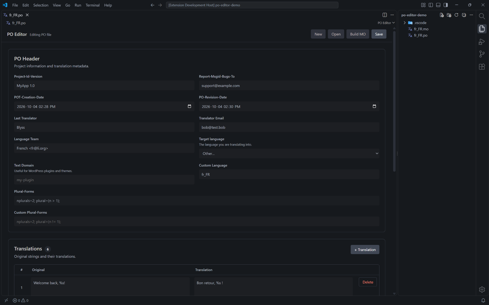
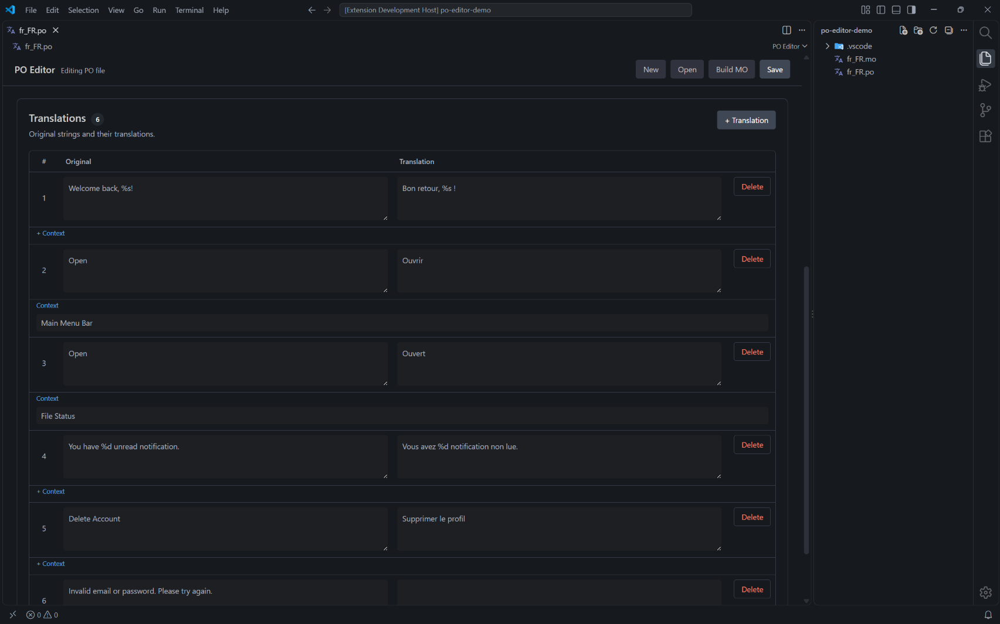

# PO Editor

**PO Editor** is a free and open-source visual editor for GNU gettext `.po` translation files, built directly for Visual Studio Code.

Edit translations with a clean visual interface instead of working directly with raw PO syntax. Create new PO files, edit existing translations, manage PO metadata and contexts, and generate compiled `.mo` files directly from VS Code.





## Features

### Visual PO editing

Open `.po` files directly in a dedicated visual editor.

* Edit original strings (`msgid`)
* Edit translations (`msgstr`)
* Add and remove translation entries
* Edit multiple entries quickly
* Unsaved-change indication
* Automatic synchronization with the underlying PO file
* Save using the standard VS Code save workflow

### Create new PO files

Create a new PO file directly from the editor.

The editor starts with an empty PO document so you can configure the metadata and add only the translations you need.

When creating a new PO file, PO Editor lets you choose where to save it and automatically uses the `.po` extension.

### PO metadata

Configure common PO header fields directly from the interface:

* Project-Id-Version
* Report-Msgid-Bugs-To
* POT-Creation-Date
* PO-Revision-Date
* Last-Translator
* Translator email
* Language-Team
* Language
* Plural-Forms
* Text Domain

The editor keeps the PO header formatted correctly when the file is saved.

### Language and plural forms

Select a target language from the built-in language list or enter a custom language code.

PO Editor automatically provides the appropriate plural-form definition for supported languages.

Custom plural-form definitions can also be entered manually when needed.

### Translation context

Add optional context to individual translations using `msgctxt`.

Context information is kept visually separate from the main translation fields so it does not interfere with the normal editing workflow.


### WordPress Text Domain

PO Editor includes a dedicated **Text Domain** field for WordPress translations.

This makes the editor useful for WordPress themes, plugins, and other projects using gettext-based localization.

### Generate `.mo` files

Compile a PO file into a binary `.mo` file directly from the editor.

No external gettext installation is required.

When generating an MO file:

* The PO file is saved first if necessary
* The MO file uses the same base filename as the PO file
* Existing MO files are detected before being overwritten
* You are asked for confirmation before replacing an existing MO file

For example:

```text
translations.po
translations.mo
```


### Existing PO files

Open an existing `.po` file in VS Code and PO Editor will use the visual editor automatically.

The underlying PO file remains a normal text file and can still be used by other gettext tools.

### Standard PO format

PO Editor works with standard gettext PO syntax rather than introducing a proprietary file format.

This means files created with PO Editor remain compatible with other gettext-based tools and workflows.

---

## How to use

### Open a PO file

Open any `.po` file in Visual Studio Code.

PO Editor will open it in the visual editor.

You can then modify translations, metadata, contexts, and other supported fields.

### Create a new PO file

Open the PO Editor command from the Command Palette:

```text
PO Editor
```

A new empty PO editor will be created.

Add your metadata and translation entries, then select **Create PO** to save the file.

### Edit translations

Each translation entry contains:

| Field       | Description                          |
| ----------- | ------------------------------------ |
| Original    | The source string (`msgid`)          |
| Translation | The translated string (`msgstr`)     |
| Context     | Optional gettext context (`msgctxt`) |

Add additional entries using **Add Entry**.

### Save changes

For existing PO files, use the normal VS Code save action:

```text
Ctrl+S
```

On macOS:

```text
Cmd+S
```

PO Editor also provides its own save action in the editor interface.

### Generate an MO file

After saving your PO file, use the **Build MO** action to generate the corresponding compiled `.mo` file.

The generated file will be placed beside the PO file using the same filename.

For example:

```text
languages/
├── my-plugin-fr_CA.po
└── my-plugin-fr_CA.mo
```

---

## Requirements

* Visual Studio Code **1.138.0 or newer**

PO Editor does **not** require gettext, WSL, Docker, PHP, WordPress, or any other external runtime.

The MO compiler is included directly in the extension.

---

## Extension Settings

This extension does not currently contribute any VS Code settings.

There are currently no configuration options that need to be added to `settings.json`.

---

## File compatibility

PO Editor is designed around the standard GNU gettext PO format.

The editor currently focuses on the most common PO workflow:

* PO headers
* `msgid`
* `msgstr`
* `msgctxt`
* plural metadata
* language metadata
* WordPress Text Domain

PO files can continue to be edited or processed with other gettext-compatible tools.

---

## Known Issues

No known major issues are currently documented.

Because PO files can contain many advanced gettext features and variations, some less common PO syntax or metadata may not yet have dedicated controls in the visual interface.

When unsupported or uncommon data is encountered, the project aims to preserve compatibility with standard PO files whenever possible.

Bug reports and feature requests are welcome through the project's [GitHub Issues](../../issues).

---

## Development

### Clone the repository

Clone the project and open it in Visual Studio Code.

### Install dependencies

Run:

```bash
npm install
```

### Compile the extension

Run:

```bash
npm run compile
```

### Run the extension

Press:

```text
F5
```

This opens a new **Extension Development Host** window with PO Editor loaded.

You can then open or create `.po` files and test the extension.

### Development workflow

The main source files are organized as follows:

```text
src/
├── extension.ts
├── POEditor.ts
├── POFile.ts
├── MOFile.ts
└── poEditor/
    └── webview/
        ├── POEditor.html
        ├── POEditor.css
        └── POEditor.js
```

### Main components

#### `extension.ts`

Extension activation and command registration.

#### `POEditor.ts`

VS Code integration for the visual PO editor, including:

* Webview management
* PO file opening
* PO file saving
* Editor communication
* MO generation
* VS Code commands

#### `POFile.ts`

PO file data model and serialization logic, including:

* Parsing PO files
* Creating new PO documents
* Serializing PO data
* PO validation

#### `MOFile.ts`

Binary MO file generation.

#### `poEditor/webview/`

The visual editor interface:

* `POEditor.html` — editor structure
* `POEditor.css` — editor styling
* `POEditor.js` — editor behavior and interaction

---

## Project Goals

PO Editor is designed around a simple goal:

> Make editing gettext translation files easier without requiring users to work directly with PO syntax.

The project aims to provide a practical visual workflow while keeping generated files compatible with existing gettext-based projects.

---

## Roadmap

The project is actively evolving.

Possible future improvements include:

* Improved plural-entry editing
* More advanced PO syntax support
* Additional gettext metadata controls
* Better validation and diagnostics
* Improved translation workflows
* More language-specific plural rules
* Import/export improvements
* UI and accessibility improvements
* Automated tests
* Improved error handling
* Additional VS Code integration
* Marketplace distribution

The roadmap may change as the project develops.

---

## Contributing

Contributions, bug reports, suggestions, and feature requests are welcome.

Before submitting a large change, opening an issue to discuss the proposed direction can help keep the project consistent.

For bugs and feature requests, use [GitHub Issues](../../issues).

Pull requests are welcome.

---

## License

This project is open source.

See the [`LICENSE`](LICENSE) file for the terms of use and redistribution.

---

## Release Notes

### 0.0.1

Initial development release.

* Visual PO editor
* Create new PO files
* Open existing PO files
* Edit PO metadata
* Edit translations
* Optional translation context
* Language selection
* Plural-form handling
* WordPress Text Domain support
* Save PO files
* Generate MO files directly from the editor

---

## VS Code Extension Guidelines

This extension is developed for Visual Studio Code and follows the general extension development guidelines provided by Microsoft.

For more information:

* [Visual Studio Code Extension Guidelines](https://code.visualstudio.com/api/references/extension-guidelines)
* [Visual Studio Code Extension API](https://code.visualstudio.com/api)
* [Visual Studio Code Markdown Support](https://code.visualstudio.com/docs/languages/markdown)
* [Markdown Syntax Reference](https://www.markdownguide.org/basic-syntax/)

---

## About

**PO Editor** is an independent open-source Visual Studio Code extension focused on making gettext translation files easier to create and maintain.

Built with:

* TypeScript
* JavaScript
* HTML
* CSS
* Visual Studio Code Webviews
* GNU gettext PO/MO formats
